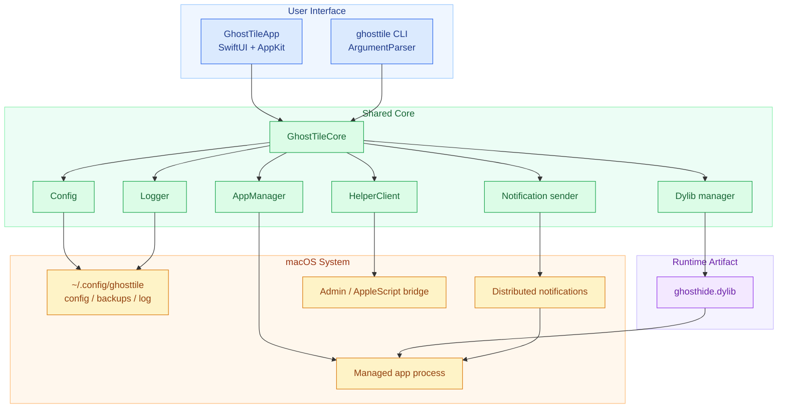

# GhostTile

GhostTile hides selected apps from the Dock and Cmd+Tab on macOS.

It ships as both:
- A native macOS app with a menu bar interface
- A CLI for managing hidden apps directly from Terminal

GhostTile works by preparing compatible apps for `DYLD_INSERT_LIBRARIES`, launching them with a small injected helper library, and then controlling Dock visibility through distributed notifications.

## Architecture



## Workflow

```mermaid
flowchart LR
    A["Select app in GUI or CLI"] --> B["Resolve bundle and executable"]
    B --> C{"Needs preparation?"}
    C -- "Yes" --> D["Backup binary"]
    D --> E["Re-sign with DYLD entitlements"]
    C -- "No" --> F["Quit running instance"]
    E --> F
    F --> G["Launch with ghosthide.dylib"]
    G --> H["Persist managed app config"]
    H --> I["Send show/hide notifications"]
    H --> J["Restore original binary on removal"]

    classDef entry fill:#dbeafe,stroke:#2563eb,color:#1e3a8a,stroke-width:1px;
    classDef decision fill:#fef3c7,stroke:#d97706,color:#92400e,stroke-width:1px;
    classDef action fill:#e0f2fe,stroke:#0891b2,color:#164e63,stroke-width:1px;
    classDef state fill:#dcfce7,stroke:#16a34a,color:#166534,stroke-width:1px;
    classDef exit fill:#f3e8ff,stroke:#9333ea,color:#6b21a8,stroke-width:1px;

    class A entry;
    class C decision;
    class B,D,E,F,G action;
    class H,I state;
    class J exit;
```



## Requirements

- macOS 15 or newer
- Xcode / Command Line Tools with SwiftPM support
- App Management permission for the GUI app
- Terminal App Management permission for some protected apps when using the CLI fallback flow

## What It Can Do

- Hide compatible apps from the Dock
- Keep a managed list of hidden apps
- Reapply hidden state when GhostTile starts
- Show or hide managed apps in the Dock without removing them
- Restore apps back to normal
- Offer a CLI fallback for cases that need elevated file access

## App Usage

1. Launch `GhostTile.app`
2. Add an app from the `Running` list, click `+`, or drag an `.app` bundle into the `Managed` column
3. GhostTile will prepare the app if needed, relaunch it hidden, and store it in the managed list
4. Use the managed row actions to show it in the Dock, hide it again, or remove it from management

The status bar menu also lets you:
- Show the main window
- Show the Overview panel
- Toggle whether GhostTile itself appears in the Dock
- Open Settings
- Activate managed apps
- Show or hide a managed app in the Dock
- Reveal a managed app in Finder
- Remove a managed app from GhostTile

In Settings, you can also assign a global shortcut for opening the Overview panel.
Inside Overview, you can search, move selection with the arrow keys, press Return to open the selected app, and press Escape to dismiss.

## CLI Usage

Build or install the CLI as `ghosttile`, then use:

```bash
ghosttile list
ghosttile manage "App Name"
ghosttile manage "/Applications/App Name.app"
ghosttile status
ghosttile hide "App Name"
ghosttile show "App Name"
ghosttile focus "App Name"
ghosttile restore "App Name"
```

Available subcommands:
- `manage`: add an app to the managed list and relaunch it hidden. Accepts a running app name, bundle ID, or app bundle path.
- `restore`: remove an app from the managed list and restore its original binary
- `hide`: send the hide notification to a managed running app
- `show`: send the show notification to a managed running app
- `list`: list running apps. Use `ghosttile list --json` for machine-readable output.
- `status`: show all managed apps and their current state. Use `ghosttile status --json` for machine-readable output.
- `focus`: bring a running app to the front

## Raycast Extension

A local Raycast extension scaffold lives in `extensions/raycast`.

It shells out to the `ghosttile` CLI and uses `ghosttile list --json` plus `ghosttile status --json` for stable machine-readable state.

## Build From Source

### Debug build

```bash
swift build
```

### Build the app bundle

```bash
just build
```

### Run locally

```bash
just run
```

### Build only the CLI

```bash
just build-cli
```

### Create a distributable zip

```bash
just dist
```

## Permissions and Caveats

- System apps and SIP-protected apps are not supported.
- Some hardened apps need extra preparation before they can be launched with the helper dylib.
- Some restore / prepare flows may require administrator privileges.
- Overview thumbnails may require Screen Recording permission to capture other apps' window content. GhostTile falls back to icon-based cards when previews are unavailable.
- GhostTile is best-effort: some apps may override activation policy after launch.

## Paths

- Config: `~/.config/ghosttile/config.json`
- Backups: `~/.config/ghosttile/backups/`
- Log: `~/.config/ghosttile/ghosttile.log`

## Repository Layout

- `Sources/GhostTileCore`: shared core logic
- `Sources/GhostTileApp`: macOS app and SwiftUI UI
- `Sources/ghosttile`: CLI entrypoint and commands
- `Resources`: app bundle resources, icons, Info.plist, injected helper source
- `justfile`: local build, packaging, and install commands
